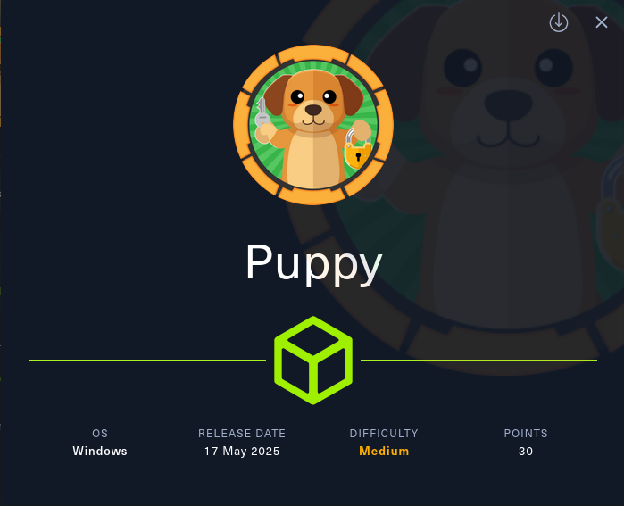

Started: 8/7/25

Creds: levi.james / KingofAkron2025!

NMAP Results

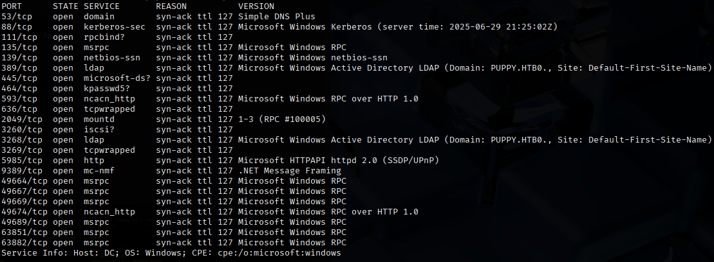

Ran RPC Client enumdomusers

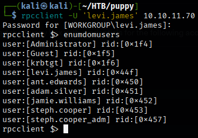

Ran NetExec and SMB Map

Interesting DEV share found

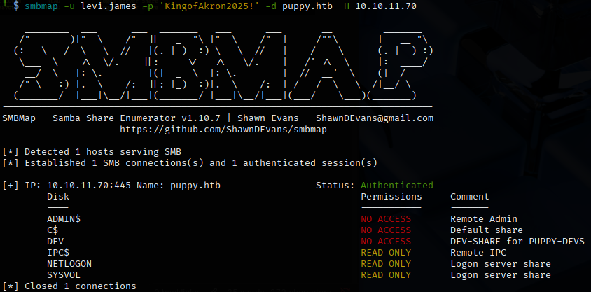

Ran bloodhound-python command to pull AD data

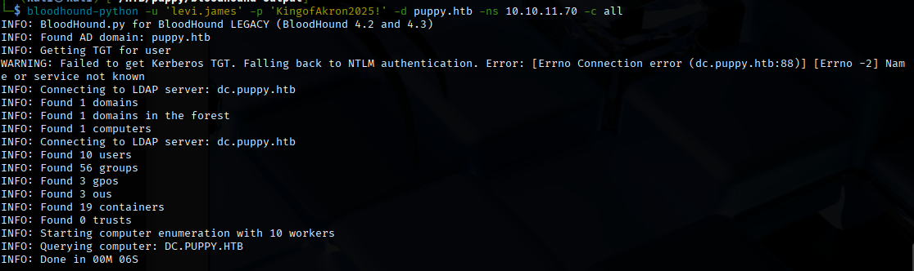

Uploaded all output from bloodhound-python command to Bloodhound CE

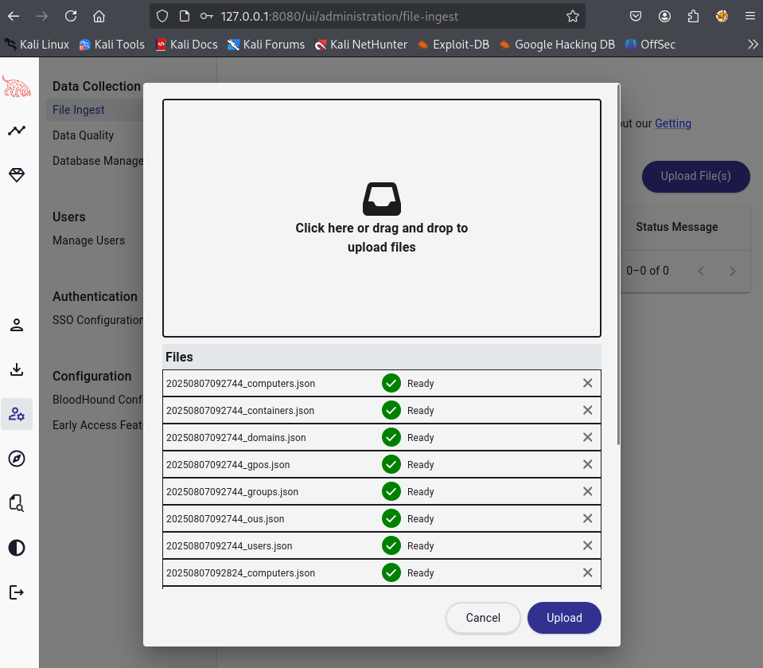

Marked user as owned and starting point

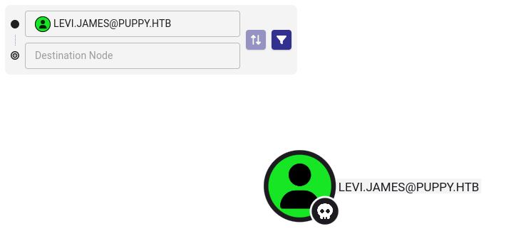

Attack path

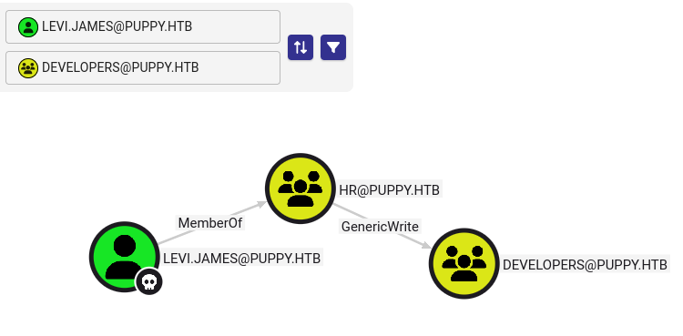

Added user to group where we can use the genericwrite to get developers user

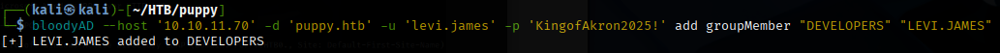

Confirmed levi.james was added to HR group

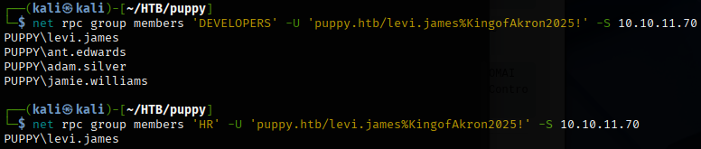

Re-ran SMB map now that we may have access to DEV SMB share

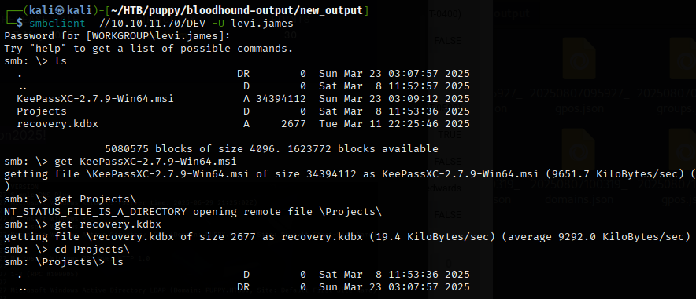

Getting keepass hash to crack with john

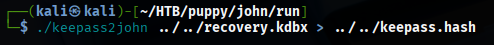

John cracked the password

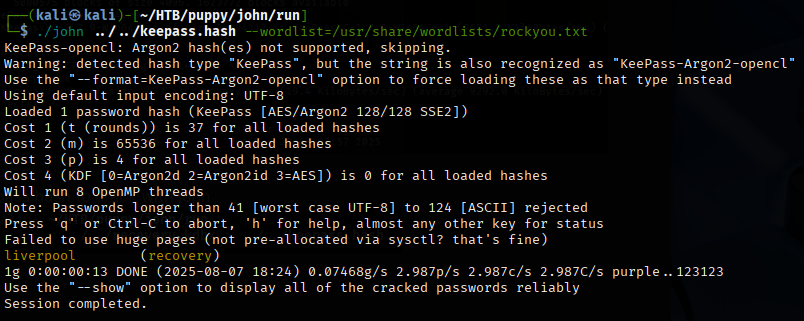

This is the cracked password. Now we can open the keepass file and get some passwords to spray with.

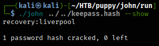

Creds available in KeePass file upon opening

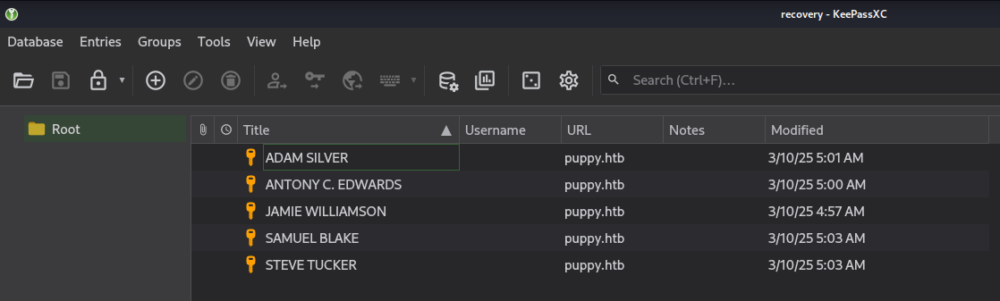

Now we can access the ant.edwards account

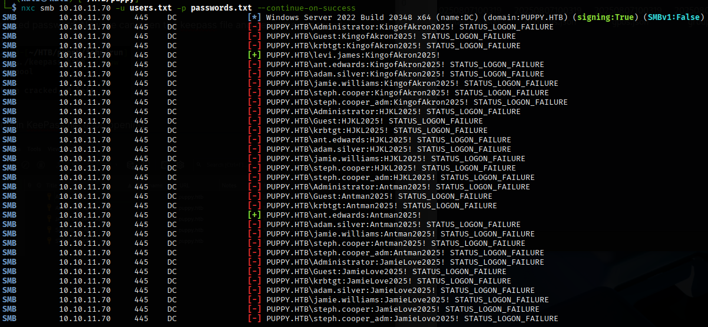

Ran bloodhound-python again to get more info using ant.edwards creds

Senior devs group has generic all for adam.silver

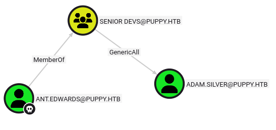

We can change adam.silver's password

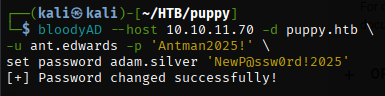

The user is disabled so we must enable them too. Once enabled and we change the password, they are in the remote management users group so we can try to get user flag using winrm.

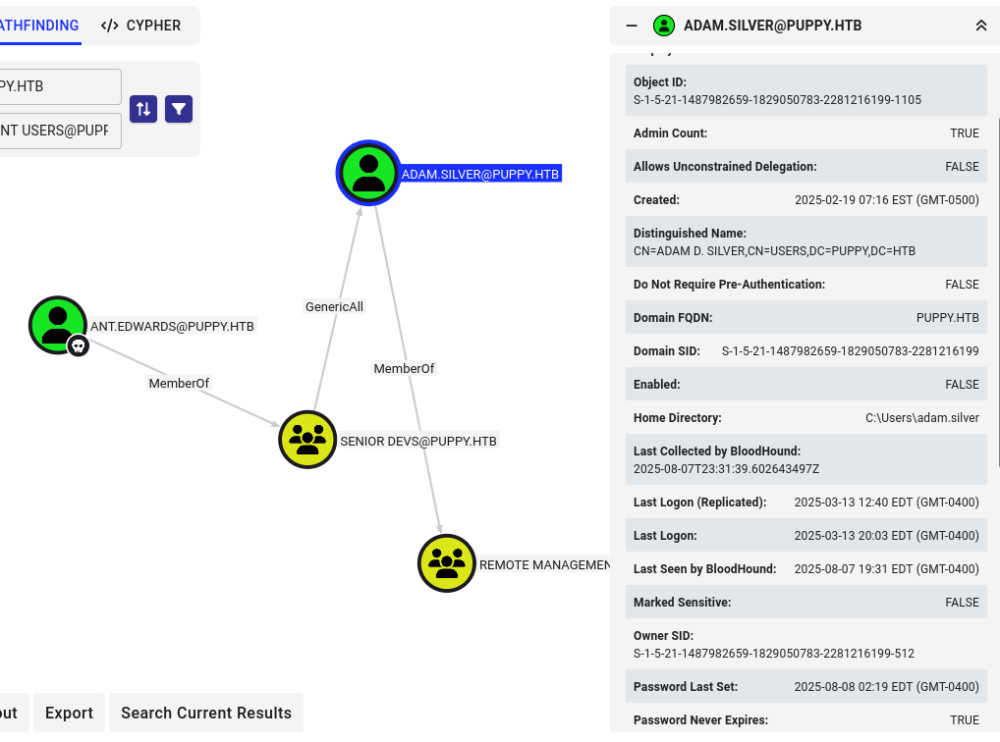

Now we can enable adam.silver and change their password to that of our choosing.

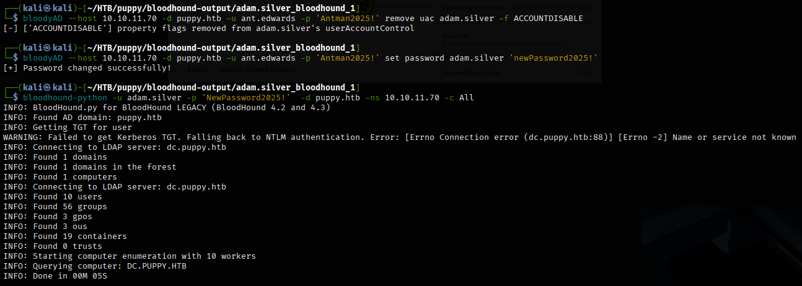

User flag obtained!
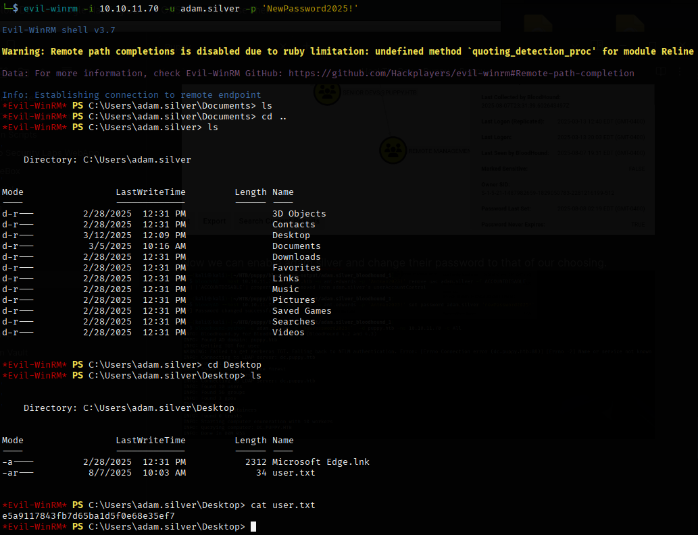

Back to bloodhound, which did not yield any viable paths that I could find.

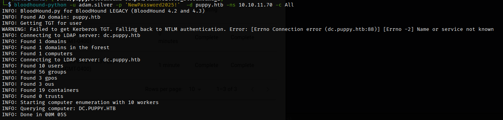

However, snooping more in the C drive revealed a backups folder containing a zip file.

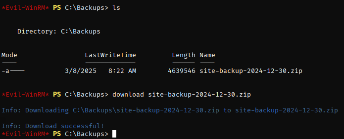

After unzipping and printing out the hidden file. We have another password to use.

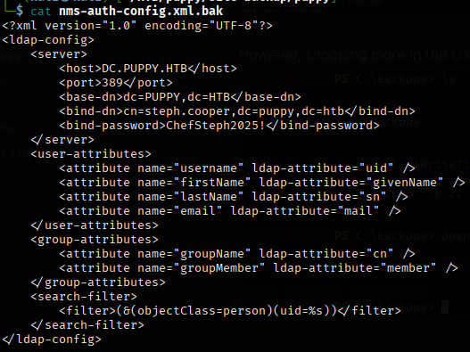

PrivEsc using dpapi
- https://pentestlab.blog/tag/sharpdpapi/
- https://notes.benheater.com/books/active-directory/page/dumping-passwords-from-windows-credential-manager

Created an SMB share to transfer the two files.

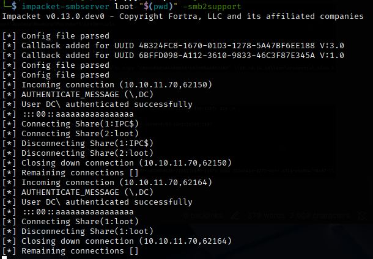

First I grabbed the credential file.

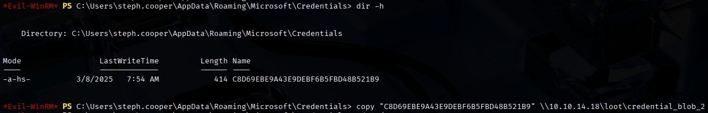

Next the master key

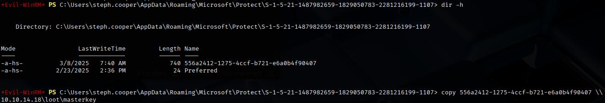

Using the master key, we can get the decrpyted key.

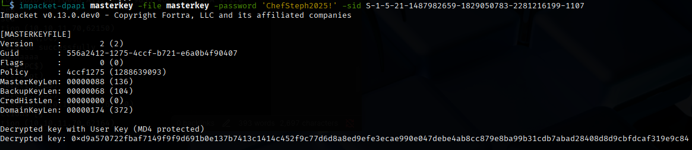

steph.cooper_adm user password stolen from the decrypted credential file.

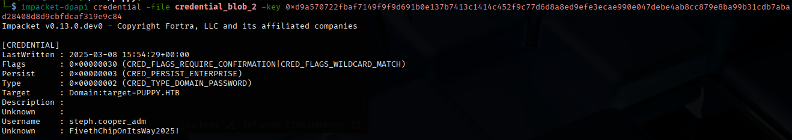

Root flag obtained

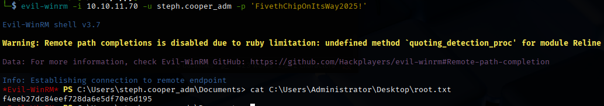

