Started: 8/9/25

Pwned: 9/11/25

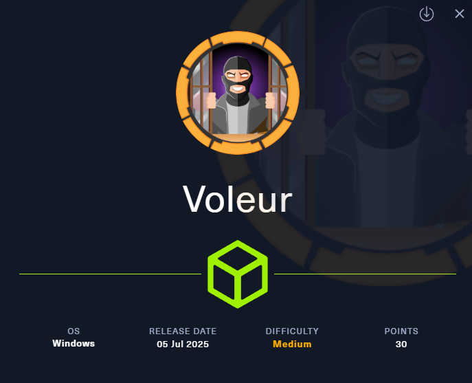

Provided Credentials: ryan.naylor / HollowOct31Nyt


###  Recon
> Command: sudo nmap -p- -sC -sV 10.10.11.76 -vv | tee nmap

```
PORT      STATE SERVICE       REASON          VERSION
53/tcp    open  domain        syn-ack ttl 127 Simple DNS Plus
88/tcp    open  kerberos-sec  syn-ack ttl 127 Microsoft Windows Kerberos (server time: 2025-08-09 21:25:10Z)
135/tcp   open  msrpc         syn-ack ttl 127 Microsoft Windows RPC
139/tcp   open  netbios-ssn   syn-ack ttl 127 Microsoft Windows netbios-ssn
389/tcp   open  ldap          syn-ack ttl 127 Microsoft Windows Active Directory LDAP (Domain: voleur.htb0., Site: Default-First-Site-Name)
445/tcp   open  microsoft-ds? syn-ack ttl 127
464/tcp   open  kpasswd5?     syn-ack ttl 127
593/tcp   open  ncacn_http    syn-ack ttl 127 Microsoft Windows RPC over HTTP 1.0
636/tcp   open  tcpwrapped    syn-ack ttl 127
2222/tcp  open  ssh           syn-ack ttl 127 OpenSSH 8.2p1 Ubuntu 4ubuntu0.11 (Ubuntu Linux; protocol 2.0)
| ssh-hostkey: 
|   3072 42:40:39:30:d6:fc:44:95:37:e1:9b:88:0b:a2:d7:71 (RSA)
| ssh-rsa AAAAB3NzaC1yc2EAAAADAQABAAABgQC+vH6cIy1hEFJoRs8wB3O/XIIg4X5gPQ8XIFAiqJYvSE7viX8cyr2UsxRAt0kG2mfbNIYZ+80o9bpXJ/M2Nhv1VRi4jMtc+5boOttHY1CEteMGF6EF6jNIIjVb9F5QiMiNNJea1wRDQ2buXhRoI/KmNMp+EPmBGB7PKZ+hYpZavF0EKKTC8HEHvyYDS4CcYfR0pNwIfaxT57rSCAdcFBcOUxKWOiRBK1Rv8QBwxGBhpfFngayFj8ewOOJHaqct4OQ3JUicetvox6kG8si9r0GRigonJXm0VMi/aFvZpJwF40g7+oG2EVu/sGSR6d6t3ln5PNCgGXw95pgYR4x9fLpn/OwK6tugAjeZMla3Mybmn3dXUc5BKqVNHQCMIS6rlIfHZiF114xVGuD9q89atGxL0uTlBOuBizTaF53Z//yBlKSfvXxW4ShH6F8iE1U8aNY92gUejGclVtFCFszYBC2FvGXivcKWsuSLMny++ZkcE4X7tUBQ+CuqYYK/5TfxmIs=
|   256 ae:d9:c2:b8:7d:65:6f:58:c8:f4:ae:4f:e4:e8:cd:94 (ECDSA)
| ecdsa-sha2-nistp256 AAAAE2VjZHNhLXNoYTItbmlzdHAyNTYAAAAIbmlzdHAyNTYAAABBBMkGDGeRmex5q16ficLqbT7FFvQJxdJZsJ01vdVjKBXfMIC/oAcLPRUwu5yBZeQoOvWF8yIVDN/FJPeqjT9cgxg=
|   256 53:ad:6b:6c:ca:ae:1b:40:44:71:52:95:29:b1:bb:c1 (ED25519)
|_ssh-ed25519 AAAAC3NzaC1lZDI1NTE5AAAAILv295drVe3lopPEgZsjMzOVlk4qZZfFz1+EjXGebLCR
3268/tcp  open  ldap          syn-ack ttl 127 Microsoft Windows Active Directory LDAP (Domain: voleur.htb0., Site: Default-First-Site-Name)
3269/tcp  open  tcpwrapped    syn-ack ttl 127
5985/tcp  open  http          syn-ack ttl 127 Microsoft HTTPAPI httpd 2.0 (SSDP/UPnP)
|_http-server-header: Microsoft-HTTPAPI/2.0
|_http-title: Not Found
9389/tcp  open  mc-nmf        syn-ack ttl 127 .NET Message Framing
49664/tcp open  msrpc         syn-ack ttl 127 Microsoft Windows RPC
49667/tcp open  msrpc         syn-ack ttl 127 Microsoft Windows RPC
61778/tcp open  ncacn_http    syn-ack ttl 127 Microsoft Windows RPC over HTTP 1.0
61779/tcp open  msrpc         syn-ack ttl 127 Microsoft Windows RPC
61780/tcp open  msrpc         syn-ack ttl 127 Microsoft Windows RPC
61806/tcp open  msrpc         syn-ack ttl 127 Microsoft Windows RPC
64897/tcp open  msrpc         syn-ack ttl 127 Microsoft Windows RPC
Service Info: Host: DC; OSs: Windows, Linux; CPE: cpe:/o:microsoft:windows, cpe:/o:linux:linux_kernel

Host script results:
| smb2-security-mode: 
|   3:1:1: 
|_    Message signing enabled and required
|_clock-skew: 8h00m00s
| p2p-conficker: 
|   Checking for Conficker.C or higher...
|   Check 1 (port 48495/tcp): CLEAN (Timeout)
|   Check 2 (port 24596/tcp): CLEAN (Timeout)
|   Check 3 (port 60782/udp): CLEAN (Timeout)
|   Check 4 (port 38288/udp): CLEAN (Timeout)
|_  0/4 checks are positive: Host is CLEAN or ports are blocked
| smb2-time: 
|   date: 2025-08-09T21:25:59
|_  start_date: N/A
```

##### Enumeration
After trying some commands, I kept getting failures with the given credentials. The error in the screenshot below shows that Kerberos authentication must be used instead of NTLM.

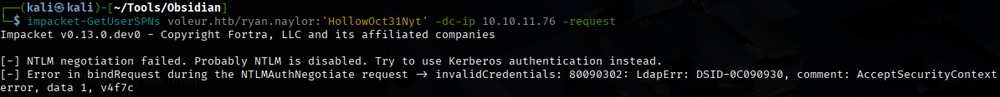

I wanted to grab the ticket cache file for my user to authenticate via Kerberos to the services on the machine as they require this rather than a username/password. Here we get the clock error indicating we must set our time.

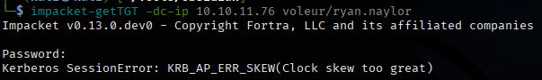


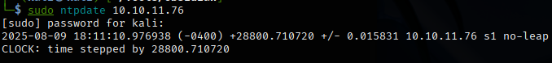

After I set the time, I re-ran the impacket-getTGT command to get the ticket cache file for our user. This TGT cache file will be used to authenticate to Kerberos-protected services on the box.

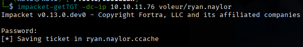

The guide I followed to do this:
- https://notes.benheater.com/books/active-directory/page/kerberos-authentication-from-kali

Edited the /etc/hosts file

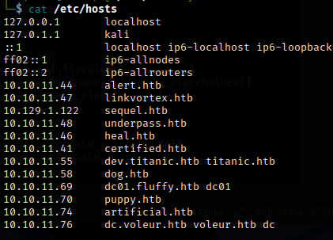

Creating custom krb5.conf

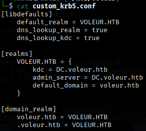

Now we can run the klist command to view the details and verify TGT is present and not expired.

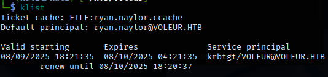

Next, I set the environment variables to my files. I did grab a new TGT cache file to ensure it was still valid as the box may have been reset while I was troubleshooting. I then ran the smb command and we now have access to the shares on the machine. The IT share sticks out to me so I'm going to check that first.

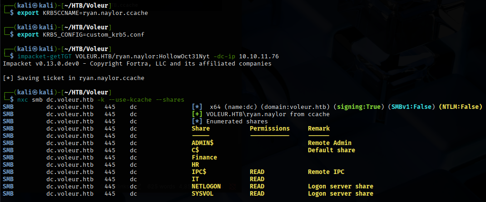

Using impacket's smbclient, we could authentiate using Kerberos and view the IT share that we discovered. Now let's look at the file we grabbed.

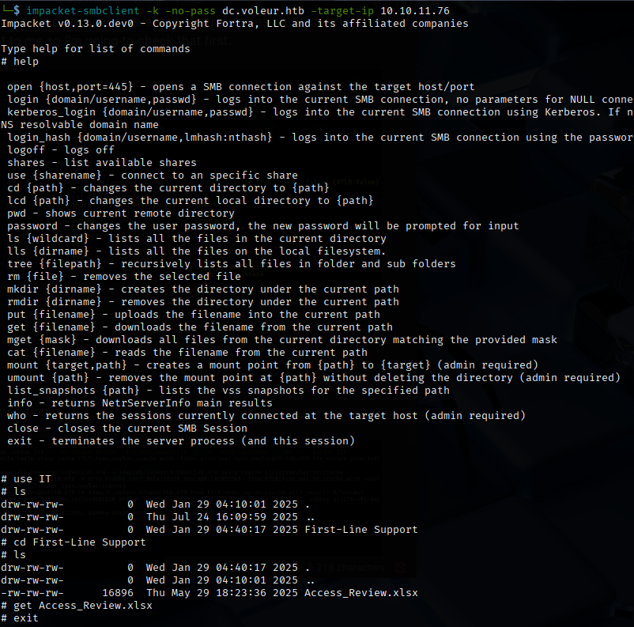

Doing some user enumeration with ldap search

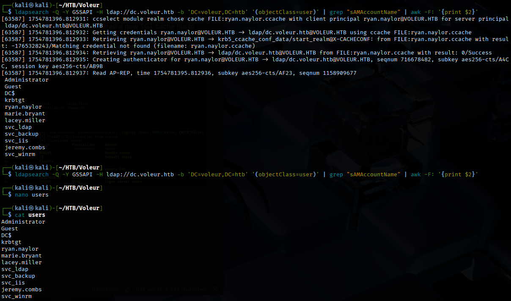


The file is password protected. Let's see if we can crack it as the password we have currently did not work.

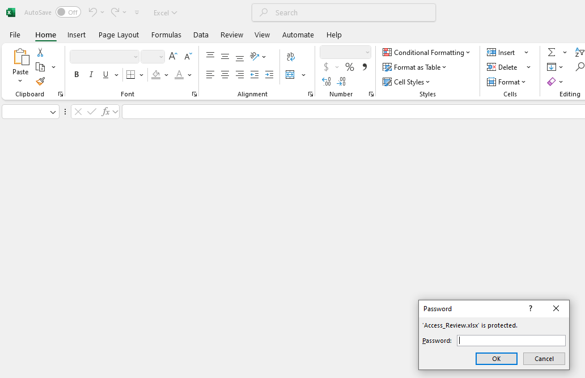

Now we can take that hash and crack it with john using rockyou wordlist.

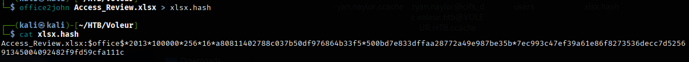

We easily cracked the password in 2 seconds. Now we can open it and likely get further credentials or information to exploit the machine.

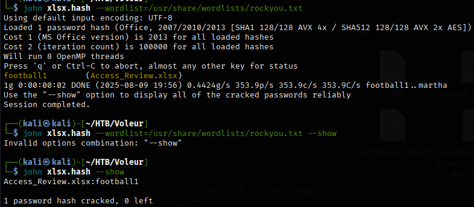

Opening the file, we now have some new passwords to try for service accounts.

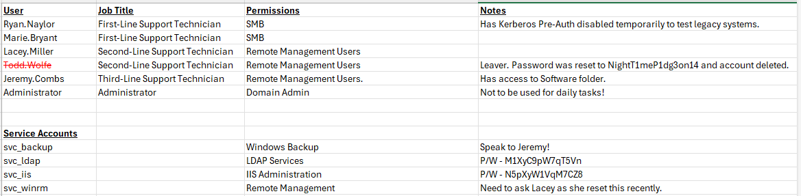

Now we can password spray.

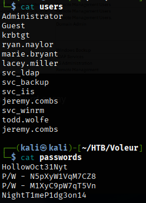

We found out that these two passwords are working on both service accounts. The other password did not work, but we will save that for later to try.
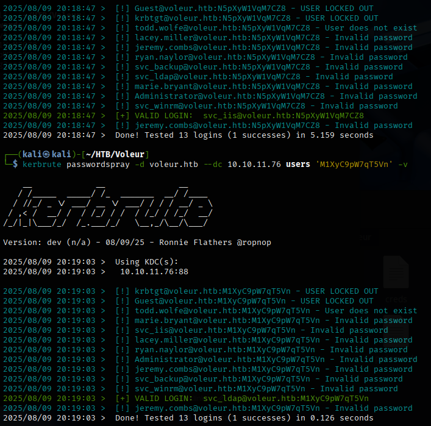

Now we can get out TGT cache files for the two accounts to try out some more enumeration. Let's do bloodhound-python using the two accounts and import all the data into bloodhound.


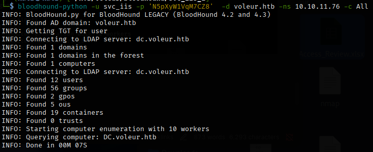

We can see that svc_ldap account has some privileges that we can abuse using WriteSPN to kerberoast that user's hash to attempt to crack it offline.

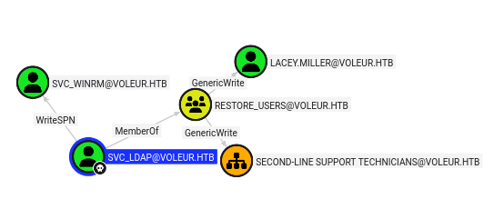


You can see we got no entries found when performing getuserspns command. Let's try to manually add an SPN and see that works.


First created an ldif file which will give the ldap server instructions to modify the svc_winrm account to give it a SPN.


Next we can run our LDAP modify and re-run our getuserspn command, and now we have a hash to attempt to crack.

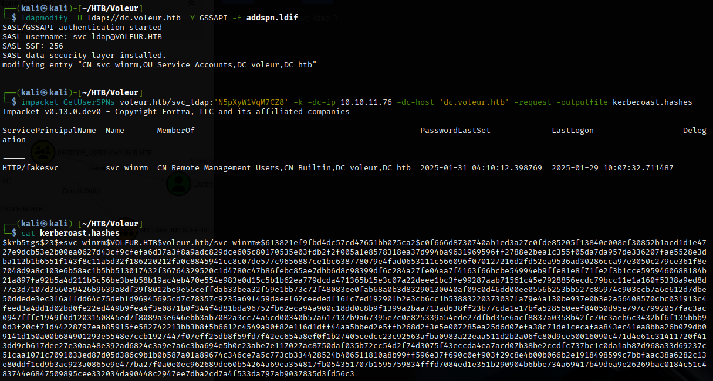

Nice! We were able to crack the hash offline using hashcat and now have win_rm access since it's in the remote management users group.


I created another ldif file and changed the spn to servicePrincipalName: HTTP/dc.voleur.htb to make it easier to connect via winrm since that was giving me trouble connecting from HTTP/fakesvc SPN. Now we are on the box and can get user.txt.


Going back a bit, we can see a user - Todd.Wolfe which has been deleted. Let's restore his account using svc_ldap as this user is a part of the restore_users group.


https://adminions.ca/books/active-directory-enumeration-and-exploitation/page/bloodyad
Once restored, we can see what they have access to in the SMB shares.

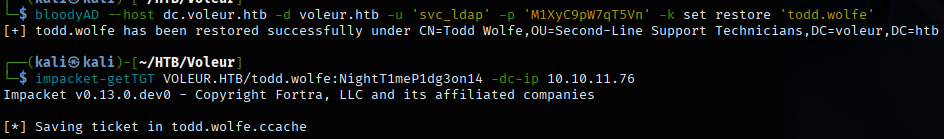

Looking at the backup of the user, we found that they had creds stored which we can decrypt by grabbing the two files and saving the SID.

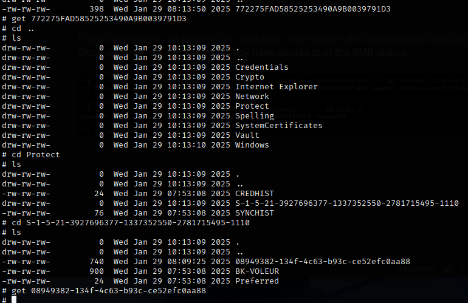

We successfully stole jeremy.combs password.

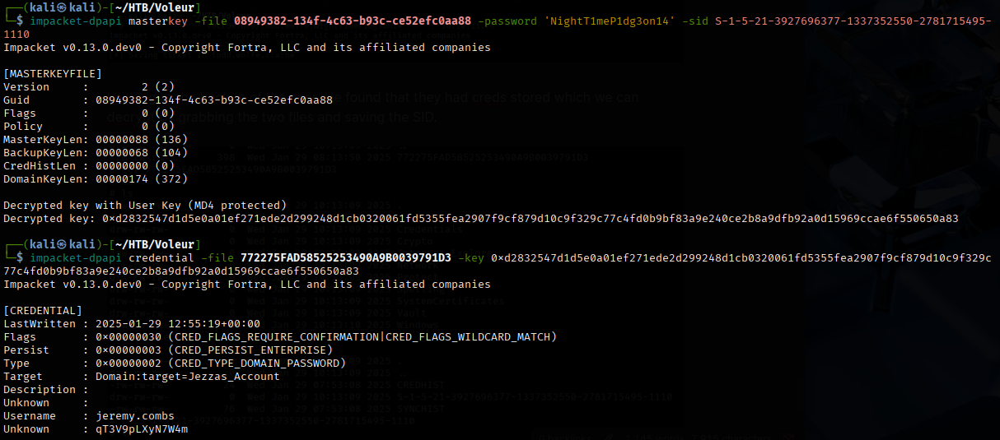

Generating jeremy.combs ticket granting ticket ccache and using impacket-smbclient again, we were able to see the Third-Line Support folder which contained an SSH key for a WSL VM.

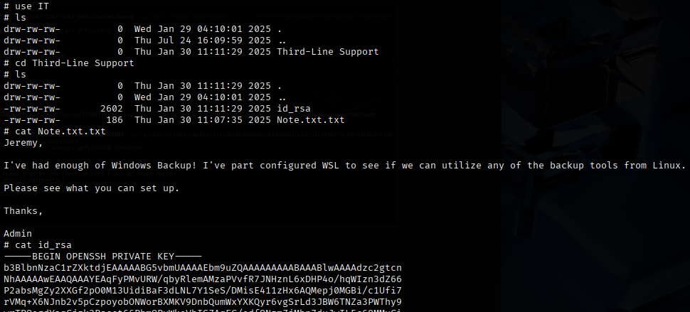

Based on the output below, I suspect that this key belongs to svc_backup. Looking back at the nmap scan we did, port 2222 is open for SSH. Let's try to login and see what we can find.

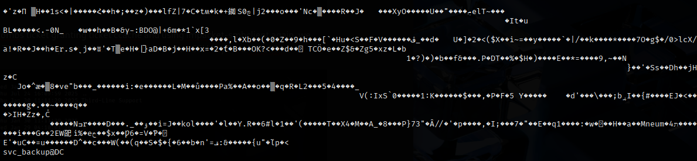

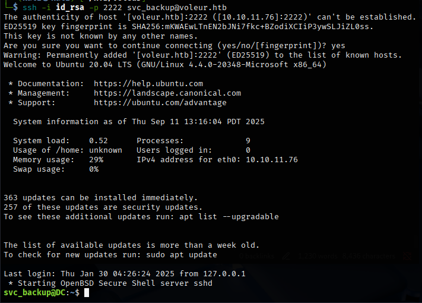

We found a new Backups folder which contains ntds.dit and the SYSTEM Hive which we can download to our system and use secrets dump to crack the password.

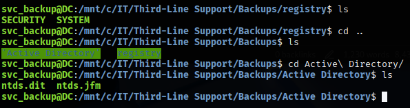

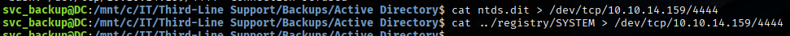

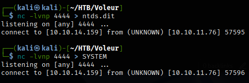

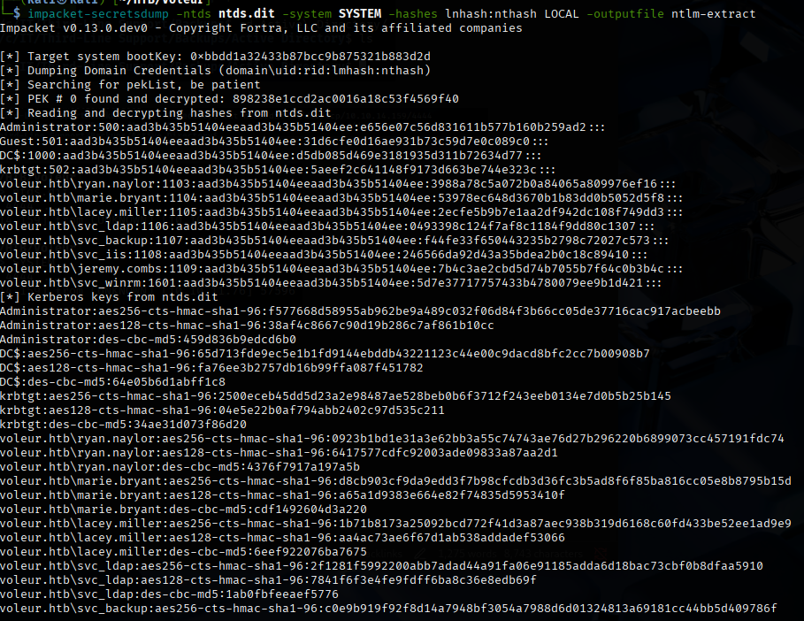

Now we can use the hash of Administrator to generate a TGT and login to print the root flag.

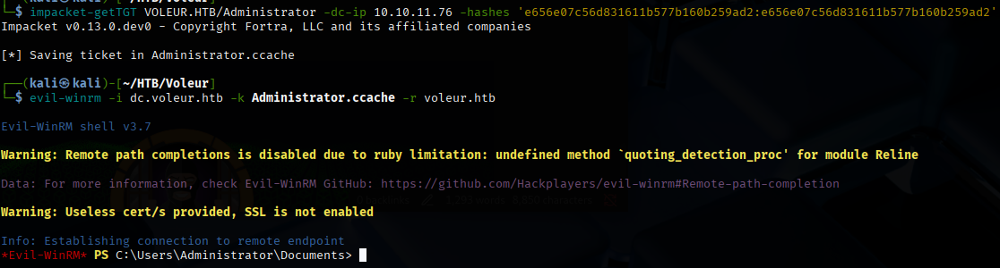

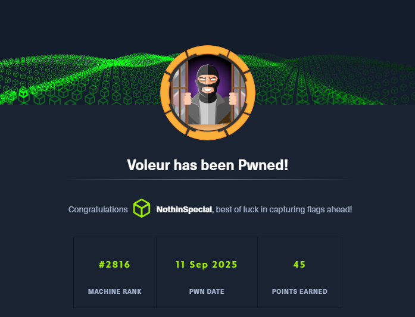
