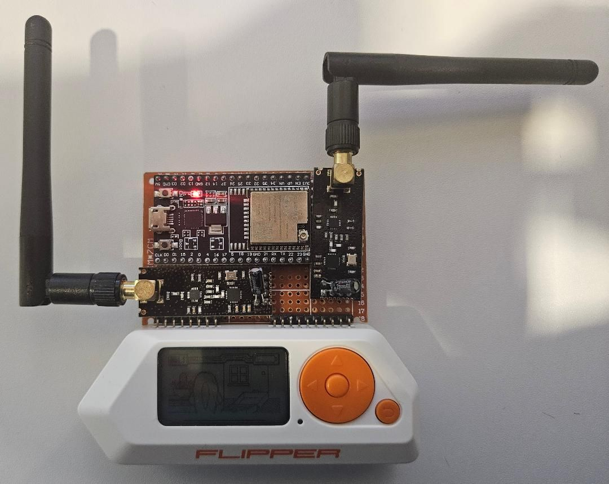

## Flipper Zero Project

### 🛠️ Custom Flipper Zero-Compatible RF Board Project
I recently built a custom PCB using an ESP32-DevKitC and two NRF24L01+PA+LNA 2.4GHz antennas, designed to work with the Flipper Zero for RF testing and signal experimentation. I flashed the Noisy Boy firmware onto the ESP32 and wired everything to support 2.4 GHz signal testing in a controlled lab environment.

### 💡 Key takeaways:
- Flashed and configured custom firmware (Noisy Boy) on ESP32
- Practiced PCB soldering and hardware prototyping
- Explored signal behavior and interference testing
- Extended Flipper Zero’s capabilities with custom RF hardware for research

⚠️ This project was built and tested strictly in a lab environment for educational purposes only. No disruptive or unauthorized activity was performed.

---

